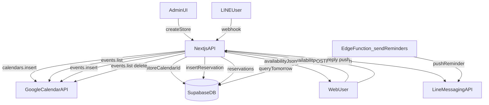

# システムアーキテクチャ全体設計

LINE LIFFを活用した予約フォーム管理システムの全体設計、要件、データフロー、技術的決定を説明します。

## 📊 システム概要

```
┌─────────────────────────────────────────────────────────────────┐
│                        LINE LIFF ユーザー                         │
│              (LINE内の予約フォーム - 静的HTML)                   │
└────────────────┬────────────────────────────────────────────────┘
                 │
         ┌───────▼────────┐
         │ Supabase Storage│
         │ Static Forms    │
         │ (HTML Deploy)   │
         └────────────────┘
                 ▲
                 │
┌────────────────┴────────────────────────────────────────────────┐
│                    Vercel Deployment                            │
├──────────────────────────────────────────────────────────────────┤
│ ┌──────────────────────────────────────────────────────────────┐│
│ │               Next.js 16 (App Router)                         ││
│ ├──────────────────────────────────────────────────────────────┤│
│ │ Frontend (React/TypeScript)                                   ││
│ │ ├─ /admin - サービス管理者ページ                              ││
│ │ ├─ /admin/help - 店舗セットアップヘルプ                      ││
│ │ ├─ /[storeId]/admin - 店舗管理ダッシュボード                 ││
│ │ ├─ /[storeId]/forms/[formId] - フォーム編集画面              ││
│ │ ├─ /home - 公開ホームページ                                  ││
│ │ ├─ /privacy - プライバシーポリシー                           ││
│ │ ├─ /terms - 利用規約                                        ││
│ │ └─ /login - ログイン画面                                     ││
│ ├──────────────────────────────────────────────────────────────┤│
│ │ Backend (API Routes)                                          ││
│ │ ├─ /api/stores/* - 店舗管理API                               ││
│ │ ├─ /api/forms/* - フォーム管理API                            ││
│ │ ├─ /api/forms/[formId]/deploy - 静的HTML生成・デプロイ       ││
│ │ ├─ /api/surveys/* - アンケートフォーム管理API                ││
│ │ ├─ /api/reservations/* - 予約管理API                        ││
│ │ ├─ /api/upload/* - 画像アップロードAPI                       ││
│ │ └─ /api/public-form/* - 公開フォームプロキシAPI              ││
│ ├──────────────────────────────────────────────────────────────┤│
│ │ Middleware (認証・ルーティング)                              ││
│ │ ├─ UI ページアクセス制御 (/admin, /[storeId]/admin など)      ││
│ │ ├─ RLS バイパス判定                                          ││
│ │ └─ アクセストークン検証                                       ││
│ └──────────────────────────────────────────────────────────────┘│
└──────────────────────────────────────────────────────────────────┘
         │                  │                 │
         ├─ staging        ├─ production     └─ local dev
         │                 │                    (JSON)
    ┌────▼──────┐    ┌────▼──────┐
    │ Supabase  │    │ Supabase  │
    │ Staging   │    │ Production│
    └───────────┘    └───────────┘
```

## 📅 Google Calendar 連携構成

GAS は使用せず、店舗作成時に Google Calendar を自動作成し、空き状況取得・予約登録・LINE 通知を Next.js + Supabase で実行します。

作成した店舗用カレンダーは、**デフォルトで `wakuwakusystemsharing@gmail.com` に writer で共有**されます（個人の Google アカウントで「カレンダーを追加」して表示・編集可能）。加えて、店舗のオーナーメール（`owner_email`）が設定されている場合はそのアドレスにも writer で共有します。共有先は `src/lib/google-calendar.ts` の `DEFAULT_CALENDAR_SHARE_EMAIL` で定義されています。

### 認証情報の配置（推奨）

- `GOOGLE_SERVICE_ACCOUNT_JSON` を **Vercel の Environment Variables** に設定します。
- `/admin` からの入力は不要です（UI なし）。
- `admin_settings` は将来的な拡張用で、現行フローでは利用しません。



## 🏗️ レイヤー構成

### 1. プレゼンテーション層（React/TypeScript）

**責務**: ユーザーインターフェース、ユーザー入力の処理、API との通信

**主要ページ**:
- `/home` - 公開ホームページ（Web予約フォーム機能紹介含む）
- `/privacy` - プライバシーポリシー
- `/terms` - 利用規約
- `/admin` - サービス管理者ダッシュボード（店舗・フォーム・予約一覧、shadcn/ui刷新）
- `/admin/help` - 店舗セットアップヘルプページ（GCPセットアップガイド等）
- `/admin/[storeId]` - サービス管理者向け店舗詳細管理（フォーム・アンケート・店舗管理者管理）
- `/[storeId]/admin` - 店舗管理者ダッシュボード（予約一覧・分析・フォーム管理、shadcn/ui刷新）
- `/[storeId]/reservations` - 予約一覧・分析ページ（shadcn/ui刷新）
- `/[storeId]/forms/[formId]` - フォーム編集画面（複数タブ対応）
- `/login` - ログイン画面（Supabase Auth連携）
- `/form/[formId]` - 顧客向けプレビュー（静的HTML描画）

**UIコンポーネント**:
- **shadcn/ui**: Radix UIベースのモダンなUIコンポーネントライブラリ
  - Avatar, Badge, Button, Card, Dialog, DropdownMenu, Input, Label, Select, Sheet, Table, Tabs, Toast, Toaster
  - `lucide-react` アイコンライブラリ
  - モバイルファーストデザイン
  - アクセシビリティ対応

**特徴**:
- Server Components + Client Components を適切に分離
- 状態管理は React hooks のみ（Zustand/Redux 不使用）
- 深くコピーしてイミュータブルな更新
- 認証は middleware + ログイン画面で制御
- shadcn/uiによる統一されたUIデザインシステム

### 2. API 層（Next.js API Routes）

**責務**: ビジネスロジック、データベース操作、外部サービス連携

**API エンドポイント**:
```
POST /api/stores - 店舗作成
GET  /api/stores - 店舗一覧
GET  /api/stores/[storeId] - 店舗詳細
PUT  /api/stores/[storeId] - 店舗更新
DELETE /api/stores/[storeId] - 店舗削除

POST /api/stores/[storeId]/forms - フォーム作成
GET  /api/stores/[storeId]/forms - フォーム一覧（店舗別）
GET  /api/forms/[formId] - フォーム詳細
PUT  /api/forms/[formId] - フォーム更新
DELETE /api/forms/[formId] - フォーム削除
POST /api/forms/[formId]/deploy - 静的HTML生成・デプロイ

POST /api/stores/[storeId]/surveys - アンケートフォーム作成
GET  /api/stores/[storeId]/surveys - アンケートフォーム一覧（店舗別）
GET  /api/surveys/[id] - アンケートフォーム詳細
PUT  /api/surveys/[id] - アンケートフォーム更新
DELETE /api/surveys/[id] - アンケートフォーム削除
POST /api/surveys/[id]/deploy - アンケートフォーム静的HTML生成・デプロイ

POST /api/reservations - 予約作成
GET  /api/reservations - 全予約一覧（管理者用）
GET  /api/stores/[storeId]/reservations - 店舗別予約一覧
GET  /api/stores/[storeId]/reservations/analytics - 予約分析データ取得（日別・時間帯別・メニュー別統計）

GET  /api/stores/[storeId]/admins - 店舗管理者一覧取得
POST /api/stores/[storeId]/admins - 店舗管理者追加
DELETE /api/stores/[storeId]/admins/[userId] - 店舗管理者削除

GET  /api/stores/[storeId]/customers - 顧客一覧（CRM）
POST /api/stores/[storeId]/customers - 顧客作成
GET  /api/stores/[storeId]/customers/[customerId] - 顧客詳細（来店履歴含む）
PUT  /api/stores/[storeId]/customers/[customerId] - 顧客更新
DELETE /api/stores/[storeId]/customers/[customerId] - 顧客削除
GET  /api/stores/[storeId]/customers/analytics - 顧客分析データ

GET  /api/integrations/google-calendar/connect - Google OAuth 認証開始（リダイレクト）
GET  /api/integrations/google-calendar/callback - Google OAuth コールバック
GET  /api/stores/[storeId]/calendar - カレンダー連携状態取得
PUT  /api/stores/[storeId]/calendar - カレンダー ID 設定
POST /api/stores/[storeId]/calendar/disconnect - カレンダー連携解除
GET  /api/stores/[storeId]/calendar/availability - カレンダー空き状況取得

POST /api/webhooks/line - LINE Messaging API Webhook（予約確認・キャンセル等）

GET  /api/admin/settings - サービス管理者設定取得・更新

POST /api/preview/generate - フォームプレビューHTML生成（保存前の編集状態をプレビュー）

PATCH /api/reservations/[reservationId] - 予約ステータス更新（管理者用）

POST /api/upload/menu-image - メニュー画像アップロード

GET  /api/public-form/[...path] - 公開フォームプロキシ（Supabase Storageから配信）

POST /api/auth/set-cookie - 認証トークンをクッキーに設定
GET  /api/auth/verify - 認証トークン検証
```

**認証方針**:
- middleware では UI ページアクセスのみ制御
- API 内で独立した認証チェック（admin client 使用可能）
- 全 API に `credentials: 'include'` で Cookie 送信

### 3. データアクセス層

#### ローカル開発（JSON ファイル）
```
data/
├── stores.json - 店舗一覧
├── forms.json - 全フォーム（マイグレーション用）
├── forms_st{storeId}.json - 店舗別フォーム
├── reservations.json - 予約一覧
└── forms_st{storeId}.json - 店舗別フォーム
```

#### Staging / Production（Supabase）
```
Database Tables:
├── stores - 店舗マスタ（ID: 6文字ランダム文字列 `[a-z0-9]{6}` またはUUID（既存データ）、google_calendar_id、google_calendar_source、google_calendar_refresh_token、line_channel_access_token）
├── forms - 予約フォーム定義（config は JSONB）
├── survey_forms - アンケートフォーム定義（config は JSONB）
├── reservations - 予約データ（line_user_id、google_calendar_event_id）
├── store_admins - 店舗管理者の権限管理
├── profiles - ユーザープロファイル
├── customers - 顧客マスタ（CRM 機能）
├── customer_visits - 顧客来店履歴
├── customer_interactions - 顧客インタラクション履歴（メモ・LINE 通知等）
└── admin_settings - システム管理者の設定（Google API等）

RLS (Row Level Security):
├── stores: 全員読み取り可、管理者のみ更新/削除
├── forms: 店舗別RLS、管理者は全店舗アクセス可
├── survey_forms: 店舗別RLS、管理者は全店舗アクセス可
├── reservations: 店舗別RLS、管理者は全店舗アクセス可
├── store_admins: 管理者のみアクセス可
└── admin_settings: 管理者のみアクセス可
```

### 4. ストレージ層

#### Supabase Storage（顧客向けフォーム HTML）
```
予約フォーム:  reservations/{storeId}/{formId}/index.html
アンケートフォーム:  surveys/{storeId}/{formId}/index.html
Local:    /public/static-forms/{formId}.html (mock)
```

#### Supabase Storage（メニュー画像）
```
Staging:  menu_images/{storeId}/{menuId}.{ext} (Supabase Storage - Staging プロジェクト)
Prod:     menu_images/{storeId}/{menuId}.{ext} (Supabase Storage - Production プロジェクト)
Local:    /public/uploads/{storeId}/{menuId}.{ext} (mock)
```

**重要**: 
- Staging と Production は **別々の Supabase プロジェクト** を使用
- 環境変数 (`NEXT_PUBLIC_SUPABASE_URL`) で自動的に適切なプロジェクトの Storage に接続
- バケット名は両環境で `forms`（プロジェクトが別なので分離される）
- 環境プレフィックス（`staging/`, `prod/`, `dev/`）は不要（プロジェクトレベルで分離されているため）
- フォームタイプ別にディレクトリを分離（`reservations/`, `surveys/`）

### 5. 静的HTML生成・デプロイ

**フロー（予約フォーム）**:
1. サービス管理者が「保存＆デプロイ」をクリック
2. API `/api/forms/{formId}/deploy` を呼び出し
3. `StaticReservationGenerator.generateHTML()` で HTML を生成
4. `SupabaseStorageDeployer.deployForm()` で Supabase Storage にアップロード
5. `static_deploy` 情報を DB に記録
6. 顧客が LINE で フォーム URL にアクセス → `/api/public-form/*` 経由で静的 HTML を表示

**フロー（アンケートフォーム）**:
1. 店舗管理者が「デプロイ」をクリック
2. API `/api/surveys/{id}/deploy` を呼び出し
3. `StaticSurveyGenerator.generateHTML()` で HTML を生成
4. `SupabaseStorageDeployer.deployForm()` で Supabase Storage にアップロード
5. `static_deploy` 情報を DB に記録
6. 顧客が LINE で フォーム URL にアクセス → `/api/public-form/*` 経由で静的 HTML を表示

**環境分離**:
- Staging 環境: Staging 用 Supabase プロジェクトの Storage にデプロイ
- Production 環境: Production 用 Supabase プロジェクトの Storage にデプロイ
- 環境変数で自動的に適切なプロジェクトに接続

**技術的特徴**:
- HTML 内に LIFF SDK + JavaScript を埋め込み
- React 不使用（軽量化のため vanilla JS）
- テーマカラーはインライン CSS で適用
- 予約フォーム: すべての設定（menu_structure など）を `FORM_CONFIG` として JSON 埋め込み
- アンケートフォーム: 質問設定を `questions` 配列として JSON 埋め込み
- プロキシURL (`/api/public-form/*`) 経由で配信することで、正しいContent-Typeヘッダーを設定

## 🔐 認証・認可設計

### ユーザー役割

| 役割 | アクセス可能な機能 | 認証方法 |
|------|-------------------|---------|
| **サービス管理者** | 全店舗・全フォーム・全予約 | Supabase Auth + admin email 確認 |
| **店舗管理者** | 自店舗のみ（admin email は不要） | Supabase Auth + RLS |
| **顧客（LINE LIFF）** | 該当フォームのみ | 不要（公開URL） |
| **ローカル開発** | 全機能（認証スキップ） | -（開発用） |

### 認証フロー

```
① ユーザーが /admin にアクセス
   ↓
② middleware が認証チェック
   - ローカル環境: スキップ
   - 本番系: Supabase から user 取得
   ↓
③ user が見つからない → /login にリダイレクト
④ ログイン成功 → accessToken を Cookie に保存
   ↓
⑤ API 呼び出し時に credentials: 'include' で Cookie 送信
⑥ API ルート内で getUser() でトークン検証
⑦ RLS で 店舗別データ 制御
```

## 📝 データモデル

### Form（フォーム定義）

```typescript
interface Form {
  id: string; // UUID または st{timestamp}
  store_id: string; // UUID または st{timestamp}
  config: FormConfig; // JSONB - 複雑な構造化データ（form_name・liff_id は config.basic_info 内）
  draft_config?: FormConfig; // 下書き版config
  status: 'active' | 'inactive' | 'paused';
  draft_status: 'none' | 'draft' | 'ready_to_publish';
  static_deploy?: StaticDeploy; // デプロイ情報
  created_at: string; // ISO 形式
  updated_at: string;
  last_published_at?: string;
}

interface FormConfig {
  basic_info: {
    form_name: string;
    store_name: string;
    liff_id: string;
    theme_color: string;
    logo_url?: string;
    notice?: string; // フォーム上部に表示する注意書き・お知らせ
  };
  menu_structure: {
    structure_type: 'category_based' | 'simple';
    categories: MenuCategory[];
    display_options: DisplayOptions;
  };
  // MenuItem / SubMenuItem / MenuOption には hide_price?: boolean フラグあり（料金非表示）
  gender_selection: {
    enabled: boolean;
    required: boolean;
    options: SelectOption[];
  };
  visit_count_selection: { ... };
  coupon_selection: { ... };
  calendar_settings: {
    business_hours: BusinessHours;
    advance_booking_days: number;
    booking_mode?: 'calendar' | 'multiple_dates'; // 日付選択モード
    multiple_dates_settings?: { ... }; // booking_mode='multiple_dates' 時の設定
  };
  ui_settings: {
    theme_color: string;
    button_style: 'rounded' | 'square';
    show_repeat_booking: boolean;
    show_side_nav: boolean;
  };
  validation_rules: { ... };
  form_type?: 'line' | 'web'; // フォームアクセス種別（LINE LIFF / Web ブラウザ）
}
```

### Store（店舗）

```typescript
interface Store {
  id: string; // 6文字ランダム文字列 `[a-z0-9]{6}` またはUUID（既存データ）
  name: string;
  owner_name: string;
  owner_email: string;
  phone?: string;
  address?: string;
  description?: string;
  website_url?: string;
  logo_url?: string; // 店舗ロゴ画像URL
  theme_color?: string; // 店舗テーマカラー
  google_calendar_id?: string; // 店舗用GoogleカレンダーID
  google_calendar_source?: 'system' | 'store_oauth'; // カレンダー連携方式
  google_calendar_refresh_token?: string; // store_oauth 時の暗号化済みリフレッシュトークン
  line_channel_access_token?: string; // LINEチャネルアクセストークン
  status: 'active' | 'inactive';
  created_at: string;
  updated_at: string;
}

interface SurveyForm {
  id: string; // 12文字ランダム文字列
  store_id: string; // 6文字ランダム文字列またはUUID
  name: string;
  config: SurveyConfig;
  status: 'active' | 'inactive' | 'paused' | 'draft';
  draft_status: 'none' | 'draft' | 'ready_to_publish';
  static_deploy?: StaticDeploy;
  created_at: string;
  updated_at: string;
  last_published_at?: string;
}
```

## 🔄 主要フロー

### 1. フォーム作成フロー

```
サービス管理者
  ↓ 店舗を選択 → フォーム作成ボタン
  ↓ テンプレート選択 → 基本情報入力
API: POST /api/stores/[storeId]/forms
  ↓
  ├─ Local: JSON に保存
  └─ Staging/Prod: Supabase に INSERT
  ↓ 同時に自動デプロイ
  ├─ StaticReservationGenerator で HTML 生成
  └─ SupabaseStorageDeployer で Supabase Storage にアップロード
  ↓ 初期状態
  - status: 'inactive'
  - draft_status: 'none'
  - static_deploy: { url, deployed_at, status: 'deployed' }
```

### 2. フォーム編集・保存フロー

```
店舗管理者が /[storeId]/forms/[formId] でフォーム編集
  ↓ 複数タブでメニュー・営業時間などを設定
  ↓ 「保存」ボタン クリック
API: PUT /api/forms/[formId]
  ↓
  ├─ Local: JSON ファイル更新
  └─ Staging/Prod: Supabase 更新（RLS 確認）
  ↓ レスポンス
  - status: 200
  - updated_at: 現在時刻
  - アラート: "フォームを保存しました"
```

### 3. 静的HTML デプロイフロー

```
店舗管理者が「保存＆デプロイ」クリック
  ↓ 1. PUT /api/forms/{formId} で保存
  ↓ 2. POST /api/forms/{formId}/deploy でデプロイ
  ↓
StaticReservationGenerator (予約フォーム) / StaticSurveyGenerator (アンケートフォーム):
  ├─ config から HTML テンプレート生成
  ├─ すべての設定を FORM_CONFIG / questions に埋め込み
  ├─ テーマカラーをインライン CSS で適用
  └─ LIFF SDK + JavaScriptで予約/アンケート処理実装
  ↓
SupabaseStorageDeployer:
  ├─ フォームタイプ別 path に決定
  │  ├─ 予約フォーム: reservations/{storeId}/{formId}/index.html
  │  └─ アンケートフォーム: surveys/{storeId}/{formId}/index.html
  ├─ 環境変数で適切な Supabase プロジェクトに接続（プロジェクトレベルで環境分離）
  ├─ Supabase Storage API でアップロード
  └─ URL を返す（プロジェクトごとに異なる公開URL）
  ↓ DB 更新
  - static_deploy: { deploy_url, storage_url, deployed_at: now, status: 'deployed', environment }
  - last_published_at: now
  ↓ 顧客が LINE でフォーム URL アクセス
  → `/api/public-form/reservations/{storeId}/{formId}/index.html` または `/api/public-form/surveys/{storeId}/{formId}/index.html` 経由で静的 HTML が表示される（React なし）
```

### 4. フォームプレビューフロー

```
店舗管理者がフォーム編集中に「プレビュー」をクリック
  ↓ 現在の編集状態（未保存）を送信
API: POST /api/preview/generate
  ↓ body: { form, storeId, formType: 'reservation' | 'survey' }
  ↓
  ├─ reservation: normalizeForm() → StaticReservationGenerator.generateHTML()
  └─ survey: StaticSurveyGenerator.generateHTML()
  ↓ レスポンス
  - Content-Type: text/html; charset=utf-8
  - Cache-Control: no-cache
  - 保存やデプロイは行わない（プレビューのみ）
```

### 5. 予約ステータス更新フロー

```
店舗管理者が予約一覧でステータス変更ボタンをクリック
  ↓
API: PATCH /api/reservations/{reservationId}
  ↓ body: { status: 'pending' | 'confirmed' | 'cancelled' | 'completed' }
  ↓
  ├─ Local: reservations.json を更新
  └─ Staging/Prod: Supabase reservations テーブルを更新
  ↓ status='cancelled' の場合
  └─ Google Calendar イベントを自動削除（設定済みの場合）
```

## 🛡️ エラーハンドリング

### 防御的な実装

1. **normalizeForm()** - 旧形式・新形式の互換性
   - Supabase JSONB が string で返される場合をパース
   - 不足しているフィールドにデフォルト値を補完

2. **StaticReservationGenerator.generateHTML() / StaticSurveyGenerator.generateHTML()** - undefined チェック
   - safeConfig に深コピーして修正
   - 全フィールドを初期化（null check を明示的に）
   - テンプレート内で ?. オプショナルチェーニング

3. **API エラー** - 日本語メッセージ
   - 400: "必須フィールドが不足しています"
   - 404: "フォームが見つかりません"
   - 500: "内部サーバーエラーが発生しました"

4. **Supabase Storage エラー** - 適切なフォールバック
   - アップロード失敗時: エラーログを記録し、デプロイ情報を更新しない
   - プロキシ配信失敗時: 404エラーを返す

## 📚 関連ドキュメント

- **SETUP.md** - 環境セットアップ手順
- **API_SPECIFICATION.md** - API 詳細仕様
- **DATABASE_MIGRATION.md** - DB マイグレーション歴
- **WORKFLOW.md** - 開発ワークフロー
- **STORE_ADMIN_MANAGEMENT.md** - 店舗管理者管理ガイド
- **SUPABASE_BEST_PRACTICES.md** - Supabase ベストプラクティス
- **MCP_SETUP_GUIDE.md** - MCP サーバ設定

---

**注意**: `src/lib/vercel-blob-deployer.ts` はリポジトリに残存していますが、Vercel Blob は非推奨です。Supabase Storage のみを使用してください。削除は次リリースで予定されています。

---

**最終更新**: 2026年3月
